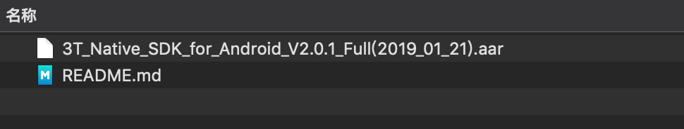
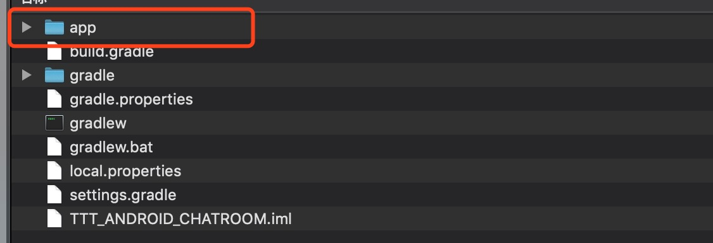
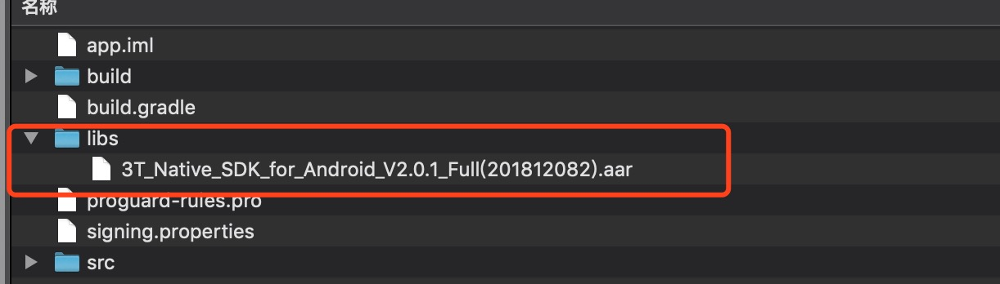
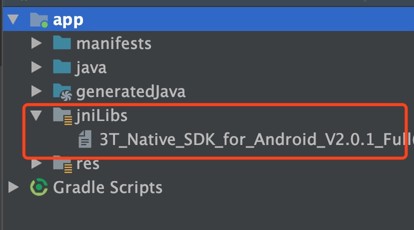

# 在线KTV
在线KTV模式越来越受到大家的欢迎，在一个房间内，多人可以排麦唱歌，拿麦者可以自定义调节歌曲伴奏音量，或者进行切歌操作，房间内的多人同时可以进行实时语音聊天。

## 典型场景
用户A创建一个KTV房间，此时A用户就是房主，后续进入房间的角色都是观众，房主可以加载一个本地或在线的MV视频文件进行在线演唱，对房间有控制权，房间内的观众可以排麦，排麦后观众角色变为麦上用户，麦上用户可以进行点歌并进行排队演唱，其他观众和房主就可以听到此用户的演唱。

> 房主：
1. 创建KTV房间，点歌并开始演唱；
2. 房主关闭房间后，所有的用户退出房间；
3. 排麦者在演唱时，房主可以调节演唱者的伴奏或进行切歌操作；

> 排麦者：
1. 加入KTV房间，点歌排麦；
2. 排麦者退出房间后，房间内其他用户还可以继续唱歌；
3. 在他人演唱时，麦上用户只能收听他人演唱，没有控制权；

# 功能列表

1. 创建 TTT 音视频引擎对象 [create](http://www.3ttech.cn/index.php?menu=72&type=Android#create)
2. 启用视频模块功能 [enableVideo](http://www.3ttech.cn/index.php?menu=72&type=Android#enableVideo)
3. 设置频道模式，PK 场景下频道模式需要设定为直播模式 [setChannelProfile](http://www.3ttech.cn/index.php?menu=72&type=Android#setChannelProfile)
4. 设置用户角色，PK 场景下需要角色设定为主播 [setClientRole](http://www.3ttech.cn/index.php?menu=72&type=Android#setClientRole) 
5. 设置 SDK 的 CDN 推流地址 [configPublisher](http://www.3ttech.cn/index.php?menu=72&type=Android#configPublisher) 
6. 加入频道 [joinChannel](http://www.3ttech.cn/index.php?menu=72&type=Android#joinChannel)
7. 创建TTT视频显示控件 [CreateRendererView](http://www.3ttech.cn/index.php?menu=72&type=Android#CreateRendererView)
8. 配置远端用户视频显示控件 [setupRemoteVideo](http://www.3ttech.cn/index.php?menu=72&type=Android#setupRemoteVideo) 
9. 创建IJK视频显示控件 [CreateIjkRendererView]
10. 开始播放MV [startIjkPlayer]
11. 停止播放MV [stopIjkPlayer]
12. 调节本地传输到远端伴奏音量 [adjustAudioMixingVolume](http://www.3ttech.cn/index.php?menu=72&type=Android#adjustAudioMixingVolume)
13. 调节本地传输到远端人声音量 [adjustAudioMixingSoloVolume](http://www.3ttech.cn/index.php?menu=72&type=Android#adjustAudioMixingSoloVolume)
14. 离开频道 [leaveChannel](http://www.3ttech.cn/index.php?menu=72&type=Android#leaveChannel)

### IjkVideoView 控件必要接口
1. 开启KTV模式 [controlKtvMode]
2. 调节伴奏的本地播放音量 [setVolume]

### 可选操作
1. 静音/取消静音 [muteLocalAudioStream](http://www.3ttech.cn/index.php?menu=72&type=Android#muteLocalAudioStream)
2. 启用说话音量提示，可选操作 [enableAudioVolumeIndication](http://www.3ttech.cn/index.php?menu=72&type=Android#enableAudioVolumeIndication)

# 示例程序

#### 准备工作
1. 在三体云官网SDK下载页 [http://3ttech.cn/index.php?menu=53](http://3ttech.cn/index.php?menu=53) 下载对应平台的 连麦直播SDK。
2. 登录三体云官网 [http://dashboard.3ttech.cn/index/login](http://dashboard.3ttech.cn/index/login) 注册体验账号，进入控制台新建自己的应用并获取APPID。

#### Android

1. 解压下载的 SDK 压缩包，内容如图所示

2. 用Android Studio，打开 **Android-KTV Demo** 工程，文件列表如图所示，复制 **3T\_Native\_SDK\_for\_Android\_Vx.x.x\_Full.aar** 到工程 **app** 项目下的 **libs** 目录下。
 
 
 
3. 引用 aar 包。在 app 项目下的 build.gradle 文件中添加红框中相应代码来引用。
 
 
 

4. 将申请到的 **APPID** 填入 SDK 的初始化函数 **create** 中，如下图所示。

5. 最后编码代码即可运行Demo。

	运行环境:
    * Android Studio 3.0 +
    * minSdkVersion 16
    * gradle 4.6
    * java 7.0

	Android权限要求:
	
	  * **android.permission.CAMERA** ---> SDK视频模块需要使用此权限用来访问相机，用于获取本地视频数据。
     * **android.permission.RECORD_AUDIO** ---> SDK音频模块需要使用此权限用来访问麦克风，用于获取本地音频数据。
     * **android.permission.INTERNET** ---> SDK的直播和通讯功能，均需要使用网络进行上传。
     * **android.permission.BLUETOOTH** ---> SDK的直播和通讯功能，均需要访问蓝牙权限，保证用户能正常使用蓝牙耳机。
     * **android.permission.BLUETOOTH_ADMIN** ---> 蓝牙权限。
     * **android.permission.MODIFY\_AUDIO\_SETTINGS** ---> SDK的直播和通讯功能，均需要访问音频路由，保证能正常切换听筒，扬声器，耳机等路由切换。
     * **android.permission.ACCESS\_NETWORK\_STATE** ---> SDK的直播和通讯功能，均需要访问网络状态。
     * **android.permission.READ\_PHONE\_STATE** ---> SDK的直播和通讯功能，均需要访问手机通话状态。

# 常见问题
1. 由于部分模拟器会存在功能缺失或者性能问题，所以 SDK 不支持模拟器的使用。

2. 主播PK模式下，不建议在房间内有副播的情况下进行，因为房间原有的副播也能与新进入的主播进行音视频互动，可能影响主播间的PK效果。